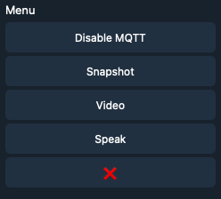
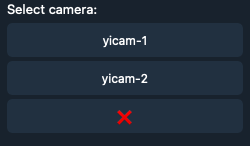
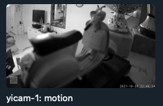
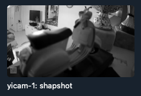
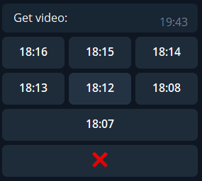
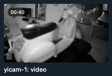

# YI Hack Telegram Bot - MQTT notifications and Web Services



## Table of Contents

- [Table of Contents](#table-of-contents)
- [Features](#features)
- [Features screenshots](#features-screenshots)
- [Prerequisites](#prerequisites)
- [Bot creation](#bot-creation)
- [Installation](#installation)
- [Performance](#performance)
- [Supported cameras](#supported-cameras)
- [Donation](#donation)

## Features

- **Authentication**
    - User Authentication based on telegram unique username
    - Administrator access logs push
- **Authorization**
    - Access Control List on single cameras for single user
- **MQTT**
    - Notifications
        - Realtime motion detection images from MQTT
        - Realtime sound detection
        - Status notification
        - Baby crying notification
    - Switch MQTT messages on and off
- **Snapshot**
    - Ask for last snapshot from cameras
- **Video**
    - Ask for n-th last video from cameras
- **Audio**
    - Text to Speech to cameras
    - Send Audio to cameras

## Features screenshots
- **Authentication**
- **Authorization**
    
    
- **MQTT**

     
- **Snapshot**

     
- **Video**

    
    
- **Audio**
    
    


## Prerequisites

### YI Cameras

Install correct **YI-Hack** firmware for your camera:

- [YI-Hack-Allwinner](https://github.com/roleoroleo/yi-hack-Allwinner/)
- [YI-Hack-Allwinner-v2](https://github.com/roleoroleo/yi-hack-Allwinner-v2/)
- [YI-Hack-MStar](https://github.com/roleoroleo/yi-hack-MStar/)
- [YI-Hack-v4](https://github.com/TheCrypt0/yi-hack-v4)
- [YI-Hack-v5](https://github.com/alienatedsec/yi-hack-v5)

### Docker (Optional)

Install:

- Docker
- Docker compose

### Broker MQTT (Optional)

- Needed for motion detection images and messages

## Bot Creation

1. Create a Telegram Bot with **BotFather**
2. Write down **Token**
3. Copy commands from `botCommands.txt` and paste on **BotFather** commands for your bot

## Installation

### Preparing configuration

- Create a **config.yaml**. See `config-example.yaml`
- Bot mode of operation, choose between:
    - **(DEFAULT) Polling bot**:
        The bot will ask to Telegram servers if there are new updates. No port to open
    - **WebHook**:
        The bot act in a passive way, very performant, but need to open port and generate certificates
        - uncomment `telegram_bot.start_web_hook()` in `main.py`
        - open port **88** on router.
        - Create a `cert.pem` and `private.key` with openssl. Place them in top folder. See [**WebHook
          guide**](https://github.com/python-telegram-bot/python-telegram-bot/wiki/Webhooks)


### Docker Install

Very simple

```shell
docker-compose up -d --build   
```

### Python Install

1. Install python
2. Create a virtual environment
3. Install python modules

```shell
  pip3 install -r requirements.txt
```

4. Run main.py

```shell
  (venv) python main.py
```

## Performance

Bot performance depends on camera availability and MQTT delay.

## Supported-Cameras

All cameras supported by **Yi-Hack** projects

## Donation

[**Donation**](paypal.me/LucaGiulianini)
